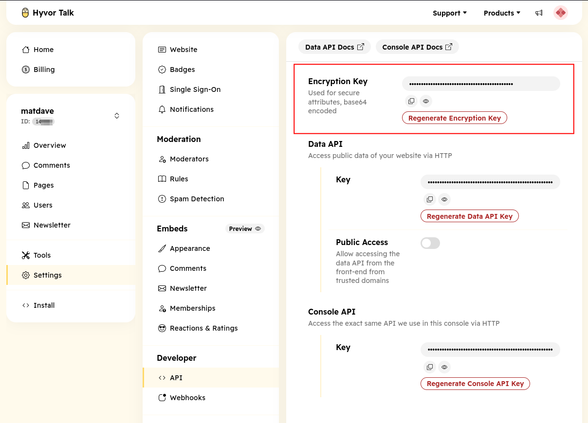
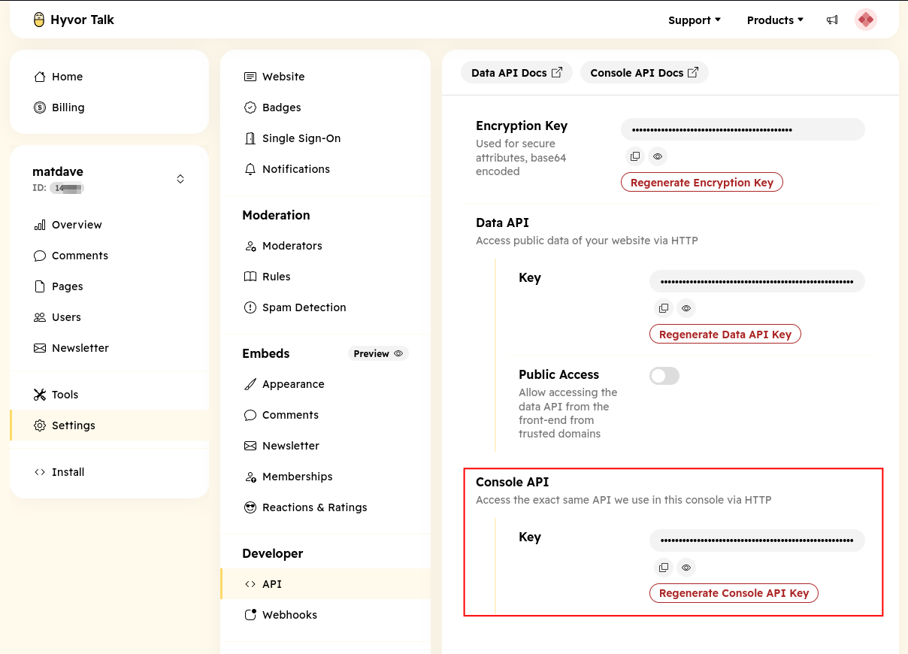

# Gated Content

Hyvor Talk allows you to restrict access to certain content on your website based on user membership or subscription 
status. This feature is useful for websites that offer premium content to paying members.

## Usage

To implement gated content using Hyvor Talk, you need to set the `hyvortalk.encryption_key` system setting in MODX. 
This key is used to encrypt the content of the gated sections. You can find your Hyvor Talk Encryption Key in the 
Hyvor Talk Console under Settings > API.



You can then use the following snippet call in place of `[[*content]]` in your templates or resources:

```html
[[!htGatedContent?
    &minimumPlan=`Your Plan Name`
]]
```

This will render the gated content section on the page where the snippet is called. The `minmumPlan` parameter specifies 
the minimum membership plan required to access the content, and is a required field.

Additionally, on any page where you want to display a signup or login button for gated content, you can use the following snippet call:

```html
[[!htMemberships]]
```
This will render the membership signup/login button and modal on the page. Additionally, it provides the logic to handle
the user authentication status for accessing gated content.

## Configuration Options

### htGatedContent Snippet

| Setting        | Default                   | Description                                                                                                                                          |
|----------------|---------------------------|------------------------------------------------------------------------------------------------------------------------------------------------------|
| `page`         | `[[*id]]`                 | The unique identifier for the page where the comment section is displayed. (This may vary if you use a different `hyvortalk.page_identifier` setting |
| `minimumPlan`  | N/A                       | (Required) The minimum membership plan required to access the gated content.                                                                         |
| `tpl`          | `hyvortalk-gated-content` | The chunk name used to render the gated content section. You can use a custom chunk to change the appearance of the gated content.                   |
| `defaultTitle` | `[[*pagetitle]]`          | Overwrite the title displayed when access is restricted.                                                                                             |
| `defaultText`  | `[[*introtext]]`          | Overwrite the text displayed when access is restricted.                                                                                              |

### htMemberships Snippet
| Setting    | Default                 | Description                                                                                                                            |
|------------|-------------------------|----------------------------------------------------------------------------------------------------------------------------------------|
| `tpl`      | `hyvortalk-memberships` | The chunk name used to render the memberships section. You can use a custom chunk to change the appearance of the memberships section. |
| `addJS`    | `1`                     | Set to `1` to include the necessary JavaScript for Hyvor Talk. Set to `0` if you want to include the JS manually in your template.     |
| `language` | `[[++cultureKey]]`      | The language code for the comment section. This should match the language codes supported by Hyvor Talk.                               |

## Template Variable
If you have multiple plan levels and want to assign specific plans to resources, you can create a Template Variable (TV)
in MODX using the `hyvortalkmemberships` input type provided by the Hyvor Talk Extra. This TV allows you to select a 
plan from a dropdown list of available membership plans.

To ensure that the TV works correctly, set the `hyvortalk.console_key` system setting. This will be your Hyvor Hvor Talk 
Console Key, which you can find in the Hyvor Talk Console under Settings > API.



Once the TV is created you can assign it to your resources and use it to control access to gated content based on the selected plan.

E.g. 

```html
[[!htGatedContent?
    &minimumPlan=`[[*your_tv_name]]`
]]
```