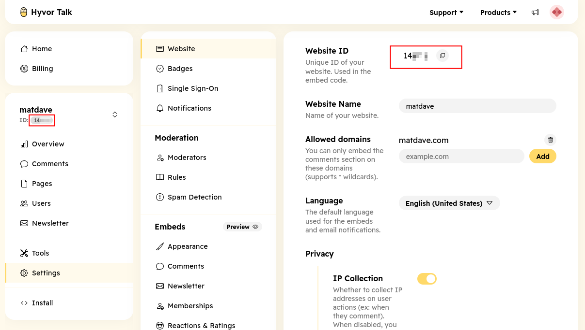

# Quick Start

Let's discover **Hyvor Talk in less than 5 minutes**.

## Getting Started

You will need a Hyvor Talk account. If you don't have one, you can sign up [here](https://talk.hyvor.com/?partner=matdaveconsole?signup).

Once you have an account, you can create a new site in the Hyvor Talk Console. This site will represent your website or 
blog where you want to add the comment section.

## Installing Hyvor Talk Extra

Install the Hyvor Talk extra from the MODX Package Manager. You can find it by searching for "Hyvor Talk".

## Configuring Hyvor Talk Extra

After installing the extra, go to the Hyvor Talk Extra settings in the MODX manager. You will need to enter your Website ID, 
which you can find in the Hyvor Talk Console under your site's settings, or directly below the site name in the dashboard.



You will need to paste the Website ID into the system setting `hyvortalk.website_id`.

## Adding the Comment Section to Your Pages

To add the comment section to your pages, you can use the following snippet call in your templates or resources:

```html
[[!htComments]]
```

That's it! You should now see the Hyvor Talk comment section on your pages.

For more customization options and advanced features, refer to the [Hyvor Talk Comments](comments.md) documentation.